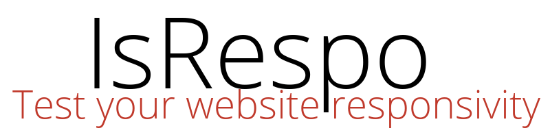
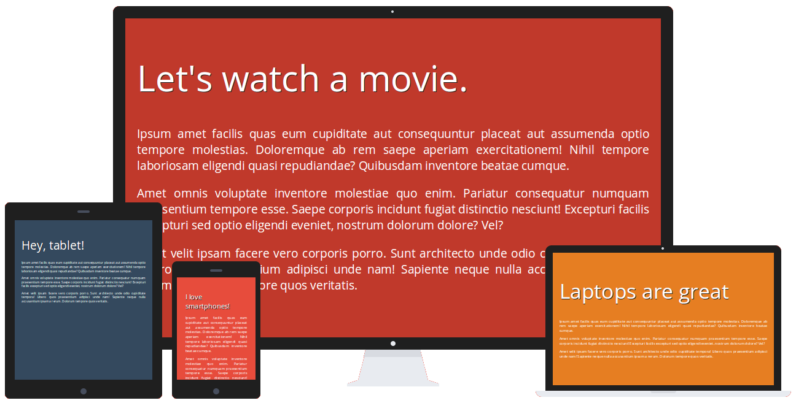

<!-- Please do not edit this file. Edit the `blah` field in the `package.json` instead. If in doubt, open an issue. -->

# `$ isrespo`

 [![Support me on Patreon][badge_patreon]][patreon] [![Buy me a book][badge_amazon]][amazon] [![PayPal][badge_paypal_donate]][paypal-donations]   

> IsRespo is a simple tool that allows us to test a webpage responsiveness on different devices: desktops, tablets, smartphones and so on. The application is open source being licensed under the MIT License.

# Simple and Beautiful
Combining the flat design with the power of HTML5 and CSS3, *IsRepo* is perfect for simulating quickly the responsiveness of your web page or web application.

# Live Demo
Click [here](http://ionicabizau.github.io/IsRespo/) for a live proview.

To access *IsRespo* directly, click the following likns:

 - English: http://ionicabizau.github.io/IsRespo/app.en.html
 - Romanian: http://ionicabizau.github.io/IsRespo/app.ro.html

# How to use
Provide your webpage url in the textbox and press <kbd>ENTER</kbd>. You can start with the [test page](http://ionicabizau.github.io/IsRespo/demo.html).

# Limitations
There are few limitations:

 - The web page is still loaded in an `iframe`. That's why we will not be able to test responsiveness for the sites that send `X-Frame-Options:deny` header.
 - This application uses only the client side, so if the device handling is done on the server side the desktop version will be loaded.

## :yum: How to contribute
Have an idea? Found a bug? See [how to contribute][contributing].

## :sparkling_heart: Support my projects

I open-source almost everything I can, and I try to reply everyone needing help using these projects. Obviously,
this takes time. You can integrate and use these projects in your applications *for free*! You can even change the source code and redistribute (even resell it).

However, if you get some profit from this or just want to encourage me to continue creating stuff, there are few ways you can do it:

 - Starring and sharing the projects you like :rocket:
 - [![Buy me a book][badge_amazon]][amazon]—I love books! I will remember you after years if you buy me one. :grin: :book:
 - [![PayPal][badge_paypal]][paypal-donations]—You can make one-time donations via PayPal. I'll probably buy a ~~coffee~~ tea. :tea:
 - [![Support me on Patreon][badge_patreon]][patreon]—Set up a recurring monthly donation and you will get interesting news about what I'm doing (things that I don't share with everyone).
 - **Bitcoin**—You can send me bitcoins at this address (or scanning the code below): `1P9BRsmazNQcuyTxEqveUsnf5CERdq35V6`

    

Thanks! :heart:

## :scroll: License

[MIT][license] © [Ionică Bizău][website]

[badge_patreon]: http://ionicabizau.github.io/badges/patreon.svg
[badge_amazon]: http://ionicabizau.github.io/badges/amazon.svg
[badge_paypal]: http://ionicabizau.github.io/badges/paypal.svg
[badge_paypal_donate]: http://ionicabizau.github.io/badges/paypal_donate.svg
[patreon]: https://www.patreon.com/ionicabizau
[amazon]: http://amzn.eu/hRo9sIZ
[paypal-donations]: https://www.paypal.com/cgi-bin/webscr?cmd=_s-xclick&hosted_button_id=RVXDDLKKLQRJW
[donate-now]: http://i.imgur.com/6cMbHOC.png

[license]: http://showalicense.com/?fullname=Ionic%C4%83%20Biz%C4%83u%20%3Cbizauionica%40gmail.com%3E%20(https%3A%2F%2Fionicabizau.net)&year=2014#license-mit
[website]: https://ionicabizau.net
[contributing]: /CONTRIBUTING.md
[docs]: /DOCUMENTATION.md
