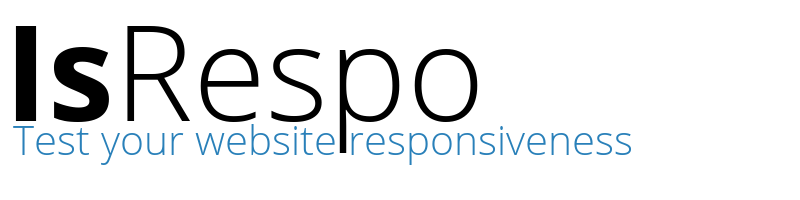

# What is «IsRespo»?
*IsRespo* is a simple tool that allows us to test a webpage resposivity on different devices: desktops, tablets, smartphones and so on.
The application is open source being licensed under the MIT License.

# Simple and Beautiful
Combining the flat design with the power of HTML5 and CSS3, *IsRepo* is perfect for simulating quickly the resposivity of your web page or web application.

# Live Demo
Click [here](http://ionicabizau.github.io/isrespo) for a live proview.

# Hacking
If you want to contribute please do the following:

1. Fork the repository
2. Add the new feature or fix a bug
3. Create a pull request and wait for merge. :smile:

# Limitations
There are few limitations:

 - The web page is still loaded in an `iframe`. That's why we will not be able to test resposivity for the sites that send `X-Frame-Options:deny` header.
 - This application uses only the client side, so if the device handling is done on the server side the desktop version will be loaded.

# License
The application is licensed under the MIT license.
For more information see the LICENSE file.
